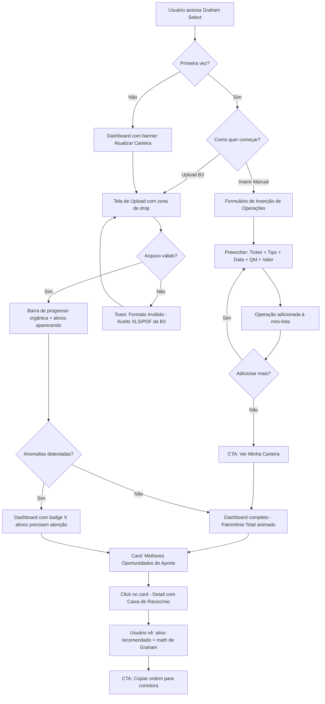
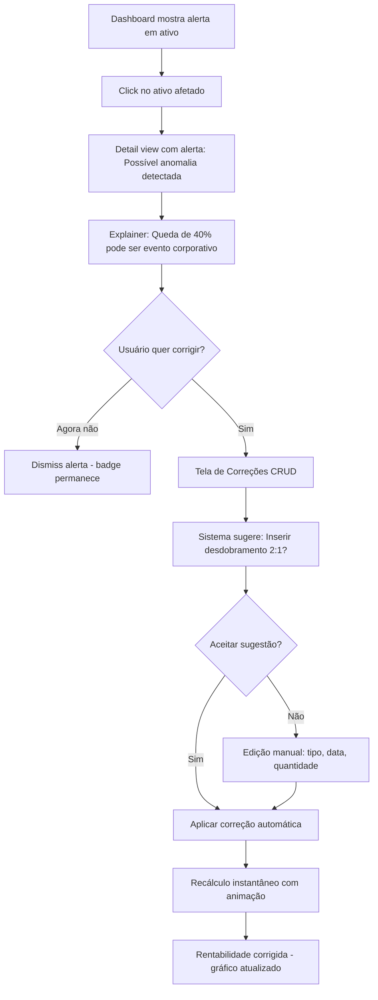
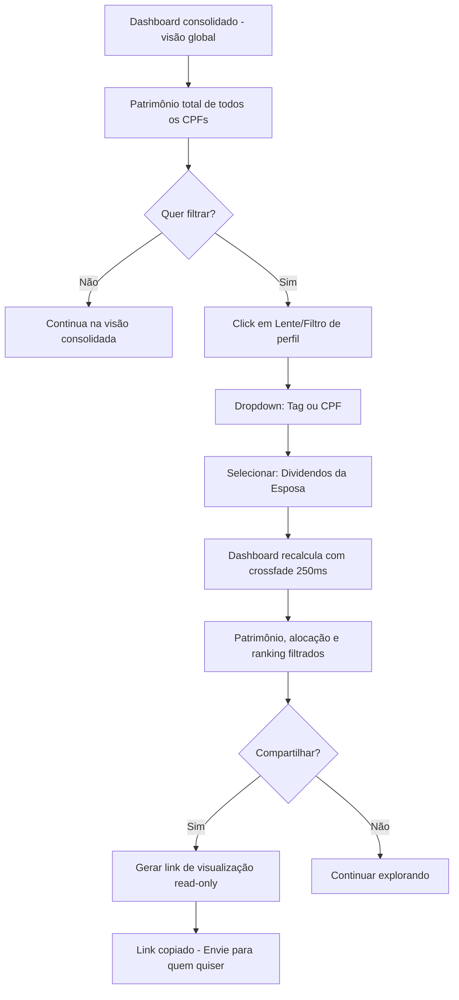

# UX Design Specification Graham Select

**Author:** Alex
**Date:** 2026-03-10

---

## Executive Summary

### Project Vision

O Graham Select é o **cérebro insubstituível do patrimônio familiar**. O produto resolve a dor visceral do investidor que tem ativos espalhados em múltiplas corretoras e CPFs (dele, da esposa, dos filhos) e perde horas em planilhas, toma decisões emocionais e nunca sente ter o controle real do seu dinheiro.

O app consolida todo o histórico financeiro em segundos a partir do upload do arquivo da B3, aplica a metodologia comprovada de Benjamin Graham para identificar as melhores oportunidades de aporte, e entrega recomendações prescritivas com transparência matemática total — eliminando o "efeito manada" e a paralisia da análise.

A experiência é projetada para ser **ultrarrápida, confiável e sem atrito**: o investidor entra, obtém o insight acionável em menos de 5 minutos e sai para executar na corretora. O valor está no *insight*, não no tempo retido por tela.

### Target Users

**Usuário Primário — O "CFO da Casa" (Investidor Familiar Híbrido)**
- Investidor intermediário/avançado que gerencia o patrimônio da família inteira
- Tem contas em 3+ corretoras distintas, incluindo cônjuge e dependentes
- Dor: gasta horas em planilhas tentando consolidar o patrimônio e nunca sabe a rentabilidade "real" da família
- Sucesso: arrastar os relatórios B3 da família inteira e ver a consolidação em segundos com "Tags/Visões Virtuais" (ex: "Aposentadoria", "Dividendos")

**Usuário Primário — O Iniciante Ambicioso (Investidor Guiado por Fundamentos)**
- Começou a investir recentemente, quer formar patrimônio via Value Investing
- Se perde nos múltiplos complexos e cai no "efeito manada" dos fóruns e influencers
- Dor: não sabe *o que* aportar na segunda-feira sem horas de pesquisa
- Sucesso: ver de maneira clara o ranking das "20 empresas mais baratas" com explicação acessível do raciocínio matemático

**Usuário Secundário — O Stakeholder Passivo (Cônjuges/Dependentes)**
- Não opera o home broker, mas tem ansiedade ao ver notícias ruins na TV
- Necessita de visualizações simplificadas que confirmem que o patrimônio está seguro e rendendo
- Confia na IA como selo de auditoria neutra das decisões tomadas pelo parceiro(a)

### Key Design Challenges

1. **O "Momento Mágico" do Upload (Onboarding):** O primeiro contato é decisivo. O usuário arrasta UM arquivo e precisa ver anos de patrimônio ganhando vida em segundos — com feedback visual progressivo. Se for lento, confuso ou gerar erro sem orientação, perdemos o usuário definitivamente. A coreografia visual do processamento assíncrono é crítica.

2. **Confiança Absoluta nos Números:** Estamos mexendo com o dinheiro das famílias. Um bug visual mostrando queda irreal (ex: -90% por evento corporativo não computado) destrói a confiança de forma irrecuperável. Precisamos de estados de loading honestos, indicadores claros de "Cotação em Cache (D-X)" e alertas inteligentes de anomalias.

3. **Complexidade vs. Simplicidade (Dual Persona):** O investidor avançado quer Tags, Lentes Analíticas, Holding Familiar, alta densidade de dados. O iniciante quer "me diz o que fazer, com linguagem simples". Precisamos servir ambos sem que nenhum se sinta abandonado ou sobrecarregado — revelação progressiva e camadas de complexidade.

4. **CRUD de Conciliação como Experiência Guiada:** Corrigir dados importados da B3 pode ser um pesadelo. Precisa ser guiado com alertas inteligentes de anomalias detectadas e experiência de "correção em poucos cliques" — não formulários genéricos.

### Design Opportunities

1. **Onboarding como Teatro:** Animações de "revelação progressiva" ao processar o arquivo B3. Enquanto processa, mostrar os ativos aparecendo gradualmente, valores se consolidando, criando a sensação de mágica — um "Spotify Wrapped" do patrimônio.

2. **Velocidade Percebida > Velocidade Real:** Skeleton screens, animações de transição fluidas, pré-carga de dados. O Flutter oferece ferramentas poderosas para isso. O app precisa *sentir-se vivo e instantâneo*, mesmo quando o backend processa em background.

3. **Guardrails Psicológicos Visuais:** As recomendações de Graham com o racional visível ("Caixa de Cálculo" — Explainable AI) são um diferencial UX gigante. Transformar a matemática em algo que o iniciante entende visualmente — gráficos simplificados, semáforos de risco, linguagem do dia-a-dia.

4. **Design Multi-CPF como Superpoder:** A alternância entre visões (minha carteira / esposa / família toda / tags personalizadas) precisa ser tão natural quanto trocar de aba — instantânea, contextual e sempre disponível no topo da hierarquia visual.

## Core User Experience

### Defining Experience

A experiência fundacional do Graham Select se define por duas ações-chave:

**Ação Core Primária — "B3 Time Machine":** Arrastar o arquivo exportado da B3 e ver anos de história financeira ganharem vida instantaneamente. Esta é a ação que valida toda a proposta de valor. O concorrente (planilha) exige horas; o Graham Select entrega segundos.

**Ação Core Recorrente — "O Que Fazer Agora":** Abrir o app semanalmente e saber exatamente onde aportar, com um racional matemático transparente baseado no Filtro de Graham. O usuário não precisa pesquisar — a resposta já está esperando.

O loop central do produto é: **Importar → Consolidar → Recomendar → Agir**. Cada etapa deve ter atrito zero.

### Platform Strategy

- **Framework:** Flutter (Cross-platform — Web primeiro, Mobile futuro)
- **Abordagem:** Desktop-first, Mobile-ready
  - O investidor sobe arquivos, configura Tags e analisa dados no computador (mouse/teclado)
  - A consulta rápida "como está meu patrimônio?" acontece no celular (touch)
  - Duas experiências complementares, otimizadas para cada contexto — não cópias idênticas
- **Offline:** Não é prioridade no MVP (dados financeiros requerem sincronização)
- **Capacidades de dispositivo:** Drag-and-drop (Web), file picker (Mobile), animações nativas de alta performance via Flutter

### Effortless Interactions

| Interação | Experiência Esperada |
|---|---|
| Upload da B3 | Arrastar arquivo → assistir ativos aparecendo progressivamente como mágica |
| Ver patrimônio consolidado | Abrir app → tudo ali, atualizado, em < 3 segundos |
| Receber recomendação de aporte | Sem configuração prévia — o app já sabe o que sugerir com base na carteira |
| Corrigir dado inconsistente | Alerta inteligente de anomalia + correção guiada em 2 cliques |
| Alternar visão (eu/esposa/família) | Um toque no filtro de perfil, recalcula instantaneamente todo o dashboard |

### Critical Success Moments

| Momento | Sucesso ✅ | Fracasso ❌ |
|---|---|---|
| **Primeiro upload** | "UAU, 5 anos de dados em 5 segundos!" → viralização | "Deu erro e não sei porquê" → desinstalação |
| **Primeira recomendação** | "Faz sentido! Entendo o porquê." → confiança | "Não sei de onde veio isso" → desconfiança |
| **Anomalia nos dados** | Alerta claro + caminho de correção guiado | Número absurdo exposto sem explicação → pânico |
| **Consulta semanal recorrente** | Dados frescos, rápido, insight acionável | Lento, desatualizado, sem novidade |

### Experience Principles

1. **⚡ "5 Segundos ou Menos"** — Cada ação crítica deve entregar valor perceptível em até 5 segundos. Se demorar mais, usar feedback progressivo (animações, contadores, ativos aparecendo).

2. **🧠 "Mostre o Raciocínio, Não Apenas o Resultado"** — Toda recomendação da IA vem com o "porquê" visual. O investidor nunca opera às cegas. Explainable AI é pilar de confiança, não feature opcional.

3. **🎭 "Duas Personas, Uma Interface"** — Revelação progressiva: o iniciante vê o essencial por padrão; o avançado destrava camadas de complexidade conforme explora. Nunca forçar um no mundo do outro.

4. **🛡️ "Confiança é Inegociável"** — Nenhum número aparece na tela sem que o estado da fonte de dados esteja claro (real-time, cache, processando). Um indicador tático de confiabilidade é sempre visível.

## Desired Emotional Response

### Primary Emotional Goals

| Emoção-Alvo | O que significa na prática |
|---|---|
| **Controle Soberano** | "Finalmente eu sei EXATAMENTE onde está cada centavo da minha família" |
| **Clareza Intelectual** | "Eu ENTENDO por que essa ação é a melhor decisão agora" |
| **Eficiência Cirúrgica** | "Resolvi em 2 minutos o que antes levava meu fim de semana" |

A emoção que faz o usuário contar para um amigo: **"Cara, eu arrastei um arquivo e vi 5 anos da minha vida financeira organizados em segundos. Nunca mais volto pra planilha."**

### Emotional Journey Mapping

| Momento | Emoção Desejada | Anti-padrão a Evitar |
|---|---|---|
| **Descoberta / Landing Page** | Curiosidade + "Isso é pra mim!" | Intimidação técnica |
| **Primeiro Upload** | Espanto → Empoderamento ("Meu Deus, funcionou!") | Ansiedade de espera silenciosa |
| **Vendo a Carteira Consolidada** | Orgulho + Controle ("ISSO é o meu patrimônio real") | Confusão com números desconhecidos |
| **Recebendo Recomendação** | Confiança + Clareza ("Faz sentido, consigo explicar pro meu cônjuge") | Desconfiança de "caixa preta" |
| **Algo deu errado (erro/anomalia)** | Segurança + Orientação ("Ok, sei o que fazer") | Pânico + Abandono |
| **Retorno semanal** | Antecipação + Hábito ("Quero ver o que mudou") | Tédio + "Nada novo" |

### Micro-Emotions

**Confiança > Ceticismo** — O investidor brasileiro foi queimado por promessas. Cada número precisa ter estado de atualização visível. Transparência total elimina ceticismo.

**Empoderamento > Ansiedade** — Mexer com patrimônio familiar gera ansiedade natural. O design deve transmitir "você está no controle" — nunca "o app decide por você".

**Realização > Frustração** — Cada interação completa deve dar micro-feedback de "feito!" — desde o upload sendo processado até a tag sendo criada.

**Antecipação > Tédio** — O retorno semanal precisa ter "algo novo" (insight atualizado, recomendação refinada, patrimônio atualizado). Se for igual à última vez, o loop de engajamento quebra.

### Design Implications

| Emoção | Decisão de Design |
|---|---|
| Controle Soberano | Dashboard consolidado como tela principal — patrimônio total sempre visível, filtros multi-CPF no topo |
| Espanto no Upload | Animação teatral de processamento — ativos aparecendo um a um, valor total crescendo progressivamente |
| Confiança na Recomendação | "Caixa de Raciocínio" sempre expandível — mostra a matemática de Graham por trás de cada sugestão |
| Segurança nos Erros | Alerta contextual com linguagem humana ("Detectamos algo estranho neste ativo. Vamos corrigir juntos?") |
| Antecipação no Retorno | Seção "O que mudou" no topo ao reabrir — highlights das variações desde o último acesso |

### Emotional Design Principles

1. **"Conquista, não Tarefa"** — Cada ação do usuário é recompensada com feedback positivo. Upload não é "subir arquivo", é "revelar seu patrimônio". Conciliação não é "corrigir erro", é "refinar sua história financeira".

2. **"Honestidade Radical"** — Nunca mascarar estados parciais. Se o dado está em cache de D-3, mostra "Atualizado até 07/03". Se o processamento falhou parcialmente, mostra quais ativos foram processados e quais precisam de atenção.

3. **"Companheiro, não Robô"** — Tom de voz do app é de consultor de confiança. Não jargão financeiro rebuscado, não linguagem infantilizante. Ponto certo: informativo, respeitoso, empoderador.

## UX Pattern Analysis & Inspiration

### Inspiring Products Analysis

**1. Gorila Invest (Concorrente Direto)**
- ✅ Importação automática via CEI/B3 — validou que o mercado quer zero atrito na ingestão de dados
- ✅ Consolidação multi-corretora funciona bem visualmente
- ❌ UX pesada com muita informação simultânea e curva de aprendizado alta
- 🎯 Lição: Consolidação é table stakes. O diferencial é a recomendação acionável que o Gorila não oferece

**2. Nubank (Referência em UX Financeira)**
- ✅ Onboarding teatral com feedback visual satisfatório em cada passo
- ✅ Linguagem acessível que trata o usuário como adulto inteligente
- ✅ Skeleton screens e animações que criam sensação de instantaneidade
- ✅ Bottom sheet patterns para ações contextuais sem perder contexto
- 🎯 Lição: Velocidade percebida e linguagem empoderadoras são o padrão-ouro de UX financeira no Brasil

**3. Spotify Wrapped (Revelação Dramática de Dados)**
- ✅ Dados históricos transformados em narrativa emocional envolvente
- ✅ Revelação progressiva que cria suspense e engajamento
- ✅ Compartilhável — o usuário se orgulha dos seus dados
- 🎯 Lição: O upload do B3 pode ser um "Financial Wrapped" — transformar dados secos em narrativa visual

**4. Notion (Complexidade Simplificada)**
- ✅ Interface limpa que esconde poder — revelação progressiva exemplar
- ✅ Dual persona nativo: casual e power user na mesma interface
- ✅ Filtros e visualizações customizáveis sem sobrecarregar
- 🎯 Lição: Tags e Lentes Analíticas podem seguir o modelo de views/filtros do Notion

### Transferable UX Patterns

**Padrões de Navegação:**
- **Dashboard Hub** (inspirado no Nubank) → Tela principal com patrimônio consolidado + cards de ações rápidas
- **Contextual Drill-down** (inspirado no Notion) → Clicou no ativo = painel lateral com detalhes, sem sair do dashboard

**Padrões de Interação:**
- **Drag & Process** (Gmail/Trello) → Arrastar arquivo B3 com zona de drop visual clara + animação de processamento
- **Progressive Disclosure** (Notion) → Interface limpa por padrão, poder sob demanda via expandir/filtrar
- **Inline Editing** (Airtable) → Corrigir dados de conciliação direto na tabela, sem modal pesado

**Padrões Visuais:**
- **Skeleton → Reveal** (Nubank) → Skeleton screens durante carregamento + ativos aparecendo em cascata
- **Trust Indicators** (Banking apps) → Badge de "Atualizado em DD/MM" sempre visível junto aos valores
- **Color-coded Status** (Semáforo) → Verde/Amarelo/Vermelho para saúde da posição e recomendações

### Anti-Patterns to Avoid

| Anti-padrão | Exemplo Negativo | Por que evitar |
|---|---|---|
| Information Overload | Gorila/StatusInvest | Muitas métricas simultâneas paralisam o iniciante |
| Jargão Financeiro Cru | Bloomberg Terminal | Nosso público não é trader profissional |
| Loading Spinner Genérico | Apps legados | Destrói a sensação de controle — o que está acontecendo? |
| Modal Hell | CRUDs tradicionais | Corrigir dados via cadeia de modais gera frustração |
| Dashboard Estático | Planilhas Google Sheets | Sem "algo novo" no retorno semanal = abandono |
| Recomendação Opaca | "Compre PETR4" sem contexto | Sem o "porquê", gera desconfiança |

### Design Inspiration Strategy

**ADOTAR:**
- Skeleton → Reveal animations (velocidade percebida)
- Linguagem empoderadoras e tom de "consultor de confiança"
- Trust indicators visíveis (timestamp de atualização)
- Dashboard Hub como tela principal com cards acionáveis

**ADAPTAR:**
- Spotify Wrapped → "B3 Time Machine" com revelação dramática no onboarding
- Notion views/filtros → Tags e Lentes Analíticas como filtros rápidos no topo
- Airtable inline editing → Conciliação de dados direto na tabela de ativos

**EVITAR:**
- Information overload estilo Gorila — priorizar 3-5 métricas chave por default
- Jargão estilo Bloomberg — traduzir para linguagem do investidor médio
- Modal chains para correção de dados — usar inline editing contextual

## Design System Foundation

### Design System Choice

**Material Design 3 (Material You)** — via `flutter/material` com customização heavy no tema. Não é o Material genérico — é o Material como alicerce invisível com identidade visual própria do Graham Select por cima.

### Rationale for Selection

1. **Integração Nativa Flutter:** Material 3 é o design system padrão do Flutter, com suporte de primeira classe, zero overhead de configuração e acesso a todos os componentes do framework
2. **Velocidade no MVP:** Componentes prontos (DataTables, Cards, Chips, BottomSheets, NavigationRail) cobrem 80% das necessidades do produto sem desenvolvimento custom
3. **Dark Mode Out-of-the-box:** Material 3 tem sistema de cores dinâmico com suporte nativo a light/dark theme via `ColorScheme.fromSeed()`
4. **Acessibilidade Built-in:** Semântica de acessibilidade, contraste de cores e suporte a screen readers já embutidos nos componentes
5. **Customização Profunda:** Material 3 permite override completo do `ThemeData`, possibilitando identidade visual única sem abrir mão de componentes testados

### Implementation Approach

- **Tokens de Design:** Definir `ColorScheme`, `TextTheme` e `ShapeBorder` customizados no `ThemeData` central
- **Paleta Graham Select:** Tons de azul-marinho (confiança/seriedade) + verde-esmeralda (crescimento/saúde financeira) + acentos dourados (prosperidade)
- **Tipografia:** Google Fonts — Inter para corpo (legibilidade de números) + DM Sans para headers (modernidade)
- **Componentes Custom:** Criar widgets especializados apenas onde Material não atende (ex: gráficos de carteira, zona de drop do B3, Caixa de Raciocínio)

### Customization Strategy

- **Não parecer "Google":** Override agressivo de bordas, elevações e cores. Bordas mais arredondadas, elevações sutis, paleta proprietária
- **Componentes de dados financeiros:** Criar widget library interna para DataTables financeiros com formatação de moeda, percentuais, e color-coded indicators
- **Motion Design:** Usar o sistema de motion do Material 3 como base mas customizar durations e curves para a "personalidade" do Graham Select — responsivo mas não agitado

## Defining Core Experience

### Defining Experience Statement

Se o Graham Select tivesse que ser descrito em UMA frase para um amigo:

> **"Arrasto meu arquivo da B3 e em 5 segundos sei exatamente quanto tenho, onde aportar, e porquê."**

Esse é o "Swipe do Tinder" do Graham Select — a interação que se viraliza.

### User Mental Model

**Como o usuário resolve hoje:**
Exporta planilha da B3 → abre no Excel → consolida manualmente → pesquisa em sites de fundamentalismo (StatusInvest, Fundamentus) → monta ranking no achismo → aporta com ansiedade

**Modelo mental que o usuário traz:**
- "Sou eu vs. a planilha" — luta solitária com dados
- "Números financeiros são complicados, preciso simplificar"
- "Se demora muito, provavelmente não é pra mim"
- "Se promete demais, provavelmente é golpe"

**Expectativa de como deveria funcionar:**
"Deveria ser como pedir um Uber — digo de onde saio (arquivo B3) e o app me diz pra onde ir (onde aportar)"

**Onde ficam confusos:**
- Eventos corporatívos (splits, bonificações) — "por que minha posição mudou?"
- Múltiplos CPFs — "a planilha mistura tudo"
- Jargão de indicadores — "P/L, P/VP, DY... qual importa?"

### Success Criteria

| Critério | Métrica |
|---|---|
| "Isso simplesmente funciona" | Upload B3 → carteira processada em < 10 segundos sem erro |
| "Me sinto inteligente" | Recomendação com racional visível que o usuário consegue explicar ao cônjuge |
| "Feedback instantâneo" | Cada ação tem resposta visual em < 300ms |
| "Automático onde deveria ser" | Cotações, cálculos de posição e ranking atualizam sem intervenção |
| "Controle onde preciso" | Tags, filtros e visões são 100% customizáveis sem wizard obrigatório |

### Novel UX Patterns

**Padrões Estabelecidos (usar sem reinventar):**
- Drag-and-drop para upload de arquivo (universal na web)
- Dashboard com cards e KPIs (padrão fintech)
- Data tables com sort/filter (padrão de dados)
- Dark/Light mode toggle (expectativa moderna)

**Padrões Novos (inovar com cuidado):**
- **"B3 Time Machine"** — Revelação teatral do processamento. Combina drag-drop familiar com revelação estilo Spotify Wrapped. Metáfora familiar + execução nova
- **"Caixa de Raciocínio"** — Painel expandível que mostra a matemática de Graham com linguagem simplificada. Não existe em apps financeiros brasileiros. Ensinar via primeiro uso
- **"Lentes Analíticas"** — Filtros tipo Notion views que reorganizam o dashboard por perspectiva (Dividendos, Crescimento, Seguros). Pattern de poder escondido sob interface simples

**Estratégia de Educação:**
- First-time tooltips contextuais (não tutorial obrigatório)
- Learn-by-doing: o primeiro upload já mostra a Caixa de Raciocínio aberta como exemplo
- Microcopy explicativo inline: "Este ranking usa o Filtro de Graham. [Saiba como funciona]"

### Experience Mechanics

**1. Iniciação — "O Convite" (Bifurcado)**
- Tela inicial limpa com duas opções igualmente proeminentes:
  - **Opção A: Upload B3** — Zona de drop central com copy: "Já tem o relatório da B3? Arraste aqui e veja sua carteira em segundos!"
  - **Opção B: Inserir Manualmente** — Card com copy: "Poucos ativos? Digite suas operações e comece a ver sua carteira agora mesmo!"
- Microcopy compartilhado: "Não sabe o que é arquivo B3? [Guia rápido em 30 segundos]"
- A bifurcação atende dois perfis: o investidor experiente (Upload B3) e o iniciante com poucos ativos (Manual)

**1b. Caminho Manual — "O Caderninho Digital"**
- Formulário simples de inserção de operações com campos:
  - **Ticker:** Autocomplete com busca (PETR4, VALE3...) — debounce 200ms
  - **Tipo:** Compra / Venda (toggle)
  - **Data da Operação:** DatePicker nativo (DD/MM/AAAA)
  - **Quantidade:** Número inteiro
  - **Valor Total Pago:** Campo monetário com máscara R$ (ex: R$ 285,00)
- Cada operação adicionada aparece numa mini-lista abaixo com resumo
- Após 1+ operação, CTA: **"Ver Minha Carteira →"**
- O sistema calcula preço médio automaticamente a partir das operações
- Banner sutil no dashboard posterior: "Quer importar mais ativos? [Faça upload do arquivo B3]"

**2. Interação — "A Mágica" (Upload B3)**
- Arquivo dropado → barra de progresso orgânica (não linear — aceleração visual)
- Ativos aparecendo um a um na tela com animação de fade-in
- Valor total crescendo progressivamente como contador
- Se houver anomalia: ícone ⚠️ sutil no ativo, sem interromper o fluxo

**3. Feedback — "A Revelação"**
- Processamento completo (upload) ou operações inseridas (manual) → transição suave para dashboard consolidado
- "Patrimônio Total" em destaque com animação de crescimento
- Badge "Processados X de Y ativos" com indicador de confiança
- Se 100%: ✅ "Carteira completa e atualizada"
- Se parcial: ⚠️ "X ativos precisam de atenção" com link para corrigir
- Se veio do manual: badge "Carteira com X operações manuais" + sugestão de upload B3 para enriquecer

**4. Completude — "O Empoderamento"**
- Dashboard carregado com patrimônio, distribuição por classe, e card de recomendação
- CTA contextual: "Veja suas melhores oportunidades de aporte →"
- Seção "Próximos passos" sugerindo: adicionar outro CPF, criar Tags, explorar recomendações
- Para usuários do caminho manual: sugestão adicional "Importe seu arquivo B3 para completar seu histórico"

## Visual Design Foundation

### Color System

**Paleta Primária — "Confiança & Crescimento"**

| Token | Cor | Uso | Psicologia |
|---|---|---|---|
| `primary` | Navy Blue `#1B2A4A` | Backgrounds, headers, navegação principal | Confiança, seriedade, estabilidade |
| `primaryVariant` | Steel Blue `#2D4A7A` | Cards, hover states, elementos interativos | Profissionalismo acessível |
| `secondary` | Emerald `#10B981` | Ganhos, positivo, CTAs de ação | Crescimento, saúde financeira |
| `accent` | Amber Gold `#F59E0B` | Alertas, insights, destaque de recomendações | Prosperidade, atenção seletiva |

**Paleta Semântica**

| Token | Cor | Uso |
|---|---|---|
| `success` | Green `#10B981` | Rentabilidade positiva, upload concluído, ação concluída |
| `warning` | Amber `#F59E0B` | Anomalia detectada, dado em cache, atenção necessária |
| `error` | Red `#EF4444` | Rentabilidade negativa, erro de processamento, falha |
| `info` | Blue `#3B82F6` | Tooltips, Caixa de Raciocínio, informação neutra |
| `surface` | Slate `#F8FAFC` (light) / `#0F172A` (dark) | Background de cards e conteúdo |

**Dark Mode (Prioridade Alta):**
- Background: `#0F172A` (Slate 900)
- Surface: `#1E293B` (Slate 800)
- Text: `#F1F5F9` (Slate 100)
- Mesmas cores semânticas com saturação ajustada para contraste WCAG AA

### Typography System

**Font Pairing:**
- **Headers:** DM Sans (Google Fonts) — moderna, clean, boa legibilidade em títulos financeiros
- **Body / Dados:** Inter (Google Fonts) — excelente para números tabulares, alta legibilidade, suporte a `tabular-nums`
- **Monospace (números financeiros):** JetBrains Mono — para valores monetários em destaque

**Type Scale (base 16px):**

| Token | Size | Weight | Uso |
|---|---|---|---|
| `displayLarge` | 36px | Bold | Patrimônio Total, números hero |
| `headlineMedium` | 24px | SemiBold | Títulos de seção |
| `titleLarge` | 20px | Medium | Títulos de cards |
| `titleMedium` | 16px | Medium | Subtítulos, labels de filtro |
| `bodyLarge` | 16px | Regular | Texto descritivo, recomendações |
| `bodyMedium` | 14px | Regular | Conteúdo de tabelas, microcopy |
| `labelSmall` | 12px | Medium | Badges, timestamps, "Atualizado em..." |

### Spacing & Layout Foundation

**Base Unit:** 8px (consistente com Material 3)
- `xs`: 4px — gap entre ícone e label
- `sm`: 8px — padding interno de badges
- `md`: 16px — padding de cards, gap entre itens de lista
- `lg`: 24px — espaço entre seções
- `xl`: 32px — margins de page content
- `2xl`: 48px — espaço entre blocos maiores

**Grid System:**
- Desktop (>1200px): 12 colunas, gutter 24px, max-width 1440px
- Tablet (768-1200px): 8 colunas, gutter 16px
- Mobile (<768px): 4 colunas, gutter 16px

**Layout Density:**
- Dashboard: moderadamente denso — dados financeiros exigem informação concentrada mas organizada
- Onboarding/Upload: arejado — foco total na ação core, sem distrações
- Tabelas de dados: alta densidade com breathing room via row padding de 12px

### Accessibility Considerations

- Contraste mínimo WCAG AA (4.5:1 para texto, 3:1 para elementos gráficos)
- Todas as cores semânticas testadas contra backgrounds light e dark
- Números financeiros nunca dependem apenas de cor (sempre acompanhados de ▲/▼ ou +/-)
- Focus indicators visíveis em todos os elementos interativos
- Font size mínimo de 14px para dados tabulares (legibilidade de valores monetários)
- Touch targets mínimo de 48x48px em mobile

## Design Direction Decision

### Design Directions Explored

**Direção 1: "O Analista" — Clean & Data-Dense**
Layout denso tipo terminal Bloomberg acessível. Dashboard com grid 3x3 de cards compactos, tabelas dominantes, dark mode padrão, navegação lateral minimalista. Ideal para CFO da Casa, risco de intimidar o Iniciante Ambicioso.

**Direção 2: "O Consultor" — Guided & Storytelling**
Layout arejado com foco em narrativa visual. Cards grandes com recomendações em destaque e Caixa de Raciocínio aberta. Wizard-like flow para ações. Ideal para Iniciante Ambicioso, risco de lentidão para o CFO da Casa.

**Direção 3: "O Equilíbrio" — Adaptive Density** ⭐
Layout adaptivo que alterna entre overview (arejado) e deep-dive (denso). Dashboard principal com 4-6 cards grandes, drill-down revelando camada densa de dados. Sidebar colapsável, "Lentes Analíticas" como tabs. Ideal para ambas as personas.

**Direção 4: "O App" — Mobile-First Gestural**
Cards fullscreen tipo carrossel com swipe. Bottom navigation com 4 seções. Micro-interações pesadas. Ideal para uso mobile-first, limitado em desktop.

### Chosen Direction

**Direção 3: "O Equilíbrio" — Adaptive Density** com elementos importados:
- Da Direção 1: Tabelas densas no deep-dive mode
- Da Direção 2: Caixa de Raciocínio aberta no primeiro uso (onboarding)
- Da Direção 4: Bottom navigation no mobile

### Design Rationale

- Resolve o dilema "duas personas, uma interface" via progressive disclosure natural (overview → deep-dive)
- Desktop-first que adapta bem para mobile
- As "Lentes Analíticas" definidas na experiência core encaixam perfeitamente como tabs no topo do dashboard
- CFO da Casa vai direto ao dado; Iniciante Ambicioso absorve no ritmo dele
- Complexidade de implementação justificada pelo valor de UX entregue

### Implementation Approach

**Estrutura de Layout:**
- Sidebar colapsável (240px expandida → 64px compacta) com navegação principal
- Content area com header contextual + breadcrumbs
- Dashboard principal: grid responsivo de 4-6 cards com drill-down
- "Lentes Analíticas" como TabBar no topo do content area

**Padrão de Interação:**
- Cards em overview mode: KPI + mini chart + action link
- Click/tap no card: expande inline ou navega para detail view
- Detail view: dados tabulares densos com sort/filter, Caixa de Raciocínio lateral
- Mobile: bottom navigation substitui sidebar, cards empilham verticalmente

**Transições:**
- Overview → Detail: fade + slide (300ms, ease-out)
- Sidebar collapse: width animation (200ms)
- Lente switch: crossfade do conteúdo (250ms)

## User Journey Flows

### Jornada 1: "A Epifania do Aporte" — Onboarding → Recomendação

**Tempo total (Upload B3):** < 60 segundos do upload à recomendação
**Tempo total (Manual):** < 2 minutos para inserir 3-5 operações e ver o dashboard
**Decisões do usuário:** 1 (qual caminho: upload ou manual). O resto é guiado.

### Jornada 2: "Recuperação Rápida" — Anomalia → Correção

**Tempo total:** < 30 segundos se aceitar sugestão automática
**Momento de confiança:** O recálculo visual imediato reforça "o sistema entende meus dados"

### Jornada 3: "Holding Familiar" — Multi-CPF → Visão Filtrada

**Tempo total:** 2 cliques do global ao filtrado
**Momento de empoderamento:** Mostrar resultado filtrado no celular para cônjuge

### Journey Patterns

| Padrão | Descrição | Usado em |
|---|---|---|
| Onboarding Bifurcado | Duas portas de entrada (Upload B3 / Manual) adaptadas ao perfil do usuário | Primeiro acesso |
| Feedback Progressivo | Mostrar resultado parcial durante processamento, nunca tela vazia | Upload, Recálculo |
| Sugestão Inteligente | Sistema sugere ação, usuário confirma ou edita | Correção, Recomendação |
| Crossfade Contextual | Mudança de perspectiva sem mudar estrutura do layout | Lentes, Filtros |
| Dismiss sem Perder | Alertas dispensados permanecem acessíveis via badge | Anomalias, Notificações |
| Copy-to-Action | Último passo é sempre uma ação objetiva e copiável | Recomendação, Compartilhar |
| Upgrade Path Sutil | Banner não-intrusivo convidando o usuário a enriquecer dados (manual→upload) | Dashboard pós-manual |

### Flow Optimization Principles

1. **Máximo 3 cliques** entre qualquer estado e o valor principal
2. **Zero dead-ends** — toda tela tem "próximo passo" ou "voltar"
3. **Error recovery inline** — nunca redirecionar para tela separada de erro
4. **Autocompletar onde possível** — se o sistema pode inferir, deve sugerir

## Component Strategy

### Design System Components

**Material 3 Flutter — Componentes disponíveis e suficientes:**
- Navegação: `AppBar`, `NavigationRail`, `NavigationBar`
- Containers: `Card`, `ListTile`, `ExpansionTile`
- Inputs: `TextField`, `DropdownMenu`, `SearchBar`
- Ações: `FilledButton`, `OutlinedButton`, `IconButton`, `FAB`
- Indicadores: `Chip`, `Badge`, `ProgressIndicator`
- Feedback: `SnackBar`, `Dialog`, `BottomSheet`
- Seleção: `TabBar`, `SegmentedButton`
- Dados: `DataTable`
- Controles: `Switch`, `Checkbox`, `Slider`

### Custom Components

**1. `PortfolioKpiCard`**
- **Propósito:** Card de KPI financeiro com valor, variação %, mini sparkline e ação
- **Estados:** loading (shimmer), loaded, error, empty
- **Variantes:** large (hero — Patrimônio Total), medium (seção), compact (grid)
- **Conteúdo:** Título, valor em R$, variação % com cor semântica (▲/▼), sparkline 30d
- **Acessibilidade:** Valor lido como "Patrimônio Total: R$ 250.000, variação positiva de 3,2%"

**2. `B3UploadZone`**
- **Propósito:** Zona de drag-and-drop para upload do arquivo B3 com estados ricos
- **Estados:** idle (animação convite), dragover (highlight), uploading (progresso orgânico), success (confetti sutil), error
- **Ações:** Drag-drop, click para selecionar, link "Onde baixar o arquivo?"
- **Acessibilidade:** Anunciado como "Região de upload de arquivo. Arraste ou pressione Enter para selecionar"

**3. `ReasoningBox` (Caixa de Raciocínio)**
- **Propósito:** Painel expansível mostrando o racional Graham por trás de uma recomendação
- **Conteúdo:** Score final, indicadores (P/L, P/VP, DY), threshold visual, explicação em linguagem simples
- **Estados:** collapsed (1 linha com score), expanded (detalhamento completo)
- **Variantes:** inline (dentro de card), sidebar (painel lateral em detail view)
- **Acessibilidade:** `aria-expanded`, conteúdo expansível via teclado

**4. `AnalyticalLensTabs` (Lentes Analíticas)**
- **Propósito:** TabBar contextual que muda a perspectiva do dashboard sem mudar a estrutura
- **Conteúdo:** Tabs: "Visão Geral", "Dividendos", "Crescimento", "Renda Fixa"
- **Comportamento:** Crossfade do conteúdo (250ms), contador de ativos por lente
- **Estados:** active, inactive, badge com contagem
- **Acessibilidade:** `role=tablist` padrão, anúncio de mudança de contexto

**5. `AnomalyAlert`**
- **Propósito:** Alerta inline para anomalias detectadas com sugestão de ação
- **Conteúdo:** Tipo (evento corporativo, dado ausente), explicação, ação sugerida
- **Estados:** active, dismissed (badge permanece), resolved
- **Ações:** "Corrigir agora", "Ignorar", expand para detalhes
- **Acessibilidade:** `role=alert`, dismiss não remove do DOM

**6. `FinancialDataTable`**
- **Propósito:** DataTable otimizada para dados financeiros com formatação automática
- **Features:** Sort multi-coluna, filter chips, formatação R$/%, color-coded cells, row actions
- **Variantes:** compact (lista de ativos), detailed (posição com breakdown)
- **Acessibilidade:** Headers `scope=col`, valores formatados em `aria-label`

**7. `ManualOperationEntry`**
- **Propósito:** Formulário de inserção manual de operações de compra/venda para onboarding alternativo
- **Campos:** Ticker (autocomplete), Tipo (Compra/Venda toggle), Data (DatePicker), Quantidade (número), Valor Total (monetário R$)
- **Estados:** empty (convite a adicionar), filling (validação inline), success (operação adicionada com micro-feedback)
- **Features:** Autocomplete de ticker com debounce 200ms, máscara monetária R$, validação em tempo real
- **Comportamento:** Cada operação adicionada aparece numa mini-lista abaixo com resumo. CTA "Ver Minha Carteira" ativo após 1+ operação
- **Acessibilidade:** Labels visíveis em todos os campos, tab order lógico, anúncio de operação adicionada via `SemanticsService.announce`

### Component Implementation Strategy

- **Tokens first:** Todos os custom components usam design tokens do Material 3 (colors, typography, spacing)
- **Composition pattern:** Custom components compostos a partir de widgets Material 3, não criados do zero
- **State management:** Cada componente com controller separado, integrável com BLoC/Riverpod
- **Testing:** Widget tests para cada estado e variante

### Implementation Roadmap

| Fase | Componentes | Justificativa |
|---|---|---|
| Fase 1 — MVP Core | `B3UploadZone`, `ManualOperationEntry`, `PortfolioKpiCard`, `FinancialDataTable` | Essenciais para a Jornada 1 (Upload ou Manual → Dashboard) |
| Fase 2 — Insights | `ReasoningBox`, `AnalyticalLensTabs` | Habilitam recomendações e visões filtradas |
| Fase 3 — Health | `AnomalyAlert` | Completa a Jornada 2 (Recuperação Rápida) |

## UX Consistency Patterns

### Button Hierarchy

| Nível | Componente | Uso | Exemplo |
|---|---|---|---|
| Primário | `FilledButton` | Ação principal da tela (1 por tela) | "Processar Carteira", "Salvar Correção" |
| Secundário | `OutlinedButton` | Ação alternativa | "Cancelar", "Ver detalhes" |
| Terciário | `TextButton` | Ação menor, navegação | "Saiba mais", "Pular" |
| Ícone | `IconButton` | Ação rápida sem label | Favoritar, filtrar, compartilhar |
| FAB | `FloatingActionButton` | Ação global recorrente | "Atualizar Carteira" (upload rápido) |

**Regras:**
- Máximo 1 `FilledButton` por tela — se há 2 ações principais, uma desce para `OutlinedButton`
- Botões destrutivos (deletar) sempre `OutlinedButton` com cor `error` + dialog de confirmação
- Mobile: botões full-width em telas de ação (upload, correção)

### Feedback Patterns

| Situação | Componente | Duração | Exemplo |
|---|---|---|---|
| Sucesso rápido | `SnackBar` (verde) | 3s auto-dismiss | "Carteira atualizada ✅" |
| Sucesso importante | `Dialog` com ação | Requer dismiss | "Upload processado! Ver dashboard?" |
| Erro recuperável | `SnackBar` (vermelho) + ação | 5s + "Tentar novamente" | "Falha no upload. Tentar novamente?" |
| Erro bloqueante | `Dialog` com explicação | Requer ação | "Formato de arquivo não suportado" |
| Warning | `AnomalyAlert` inline | Persistente | "Possível anomalia em ITUB4" |
| Info/Dica | `Tooltip` ou `Banner` | Contextual | "Dica: arraste o arquivo aqui" |
| Loading | `Shimmer` + skeleton | Até completar | Cards com shimmer durante fetch |

**Regras:**
- Nunca usar spinner genérico. Sempre shimmer/skeleton que antecipa o conteúdo
- Feedback de erro sempre inclui "o que fazer agora"
- SnackBars nunca cobrem botões de ação primária

### Form Patterns

- Validação inline em tempo real (debounce 300ms), nunca só no submit
- Labels sempre visíveis (nunca só placeholder). Placeholder como exemplo ("Ex: R$ 2.000")
- Erros: mensagem abaixo do campo em `error` color, com ícone + texto explicativo
- Campos monetários: máscara automática R$ com separadores (1.000,00)
- Campos de data: DatePicker nativo com fallback para input formatado (DD/MM/AAAA)
- Autocomplete para ticker de ações (PETR4, VALE3) com debounce 200ms
- Auto-save com indicator "Salvo ✓" sutil no header (nunca botão "Salvar" para edições inline)

### Navigation Patterns

**Desktop:**
- `NavigationRail` (sidebar) com 5 destinos máximo: Dashboard, Carteira, Recomendações, Correções, Configurações
- Sidebar colapsável: expandida mostra ícone + label, compacta só ícone
- Breadcrumbs no header para deep navigation (Dashboard > Carteira > PETR4)

**Mobile:**
- `NavigationBar` (bottom) com 4 destinos: Dashboard, Carteira, Insights, Perfil
- Sem breadcrumbs — usar back button nativo + título contextual no AppBar

**Regras:**
- Navegação nunca muda durante uma ação em progresso
- Deep link para qualquer tela via URL (web) — `/dashboard/carteira/PETR4`
- Tab ativa sempre highlighted, badge de notificação se houver ação pendente

### Empty States & Loading

**Empty States:**
- Ilustração vetorial leve + título + descrição + CTA
- Exemplo: "Nenhum ativo encontrado" → "Faça upload do seu arquivo B3 para começar" → [Fazer Upload]
- Nunca tela completamente vazia — sempre uma ação construtiva

**Loading:**
- Skeleton screens imitando o layout final (não spinner)
- Conteúdo aparece progressivamente (não tudo de uma vez)
- Se > 3s: mensagem "Processando seus dados..." com progresso se disponível

## Responsive Design & Accessibility

### Responsive Strategy

**Desktop (≥1024px) — Experiência Plena:**
- Layout multi-coluna: sidebar (`NavigationRail`) + área principal + painel lateral opcional
- Densidade de dados alta — tabelas expandidas, KPIs lado a lado, gráficos full-width
- Hover states ricos: tooltips em indicadores, preview on hover
- Drag-and-drop para upload (B3UploadZone) e reordenação de watchlists

**Tablet (768px–1023px) — Híbrido Toque:**
- Sidebar colapsa para ícones-only, expansível via tap
- Cards em grid 2-colunas (KPIs), tabelas com scroll horizontal
- Gestos de swipe para navegar entre tabs (Carteira ↔ Recomendações)
- Touch targets mínimo 48x48dp

**Mobile (<768px) — Mobile-First Essencial:**
- `NavigationBar` (bottom) com 4 destinos
- Layout single-column, cards empilhados
- Upload via seleção de arquivo (sem drag-and-drop)
- Dados resumidos — expandir sob demanda ("Ver detalhe")
- Pull-to-refresh para atualizar dashboard

### Breakpoint Strategy

| Breakpoint | Valor | Abordagem Flutter |
|---|---|---|
| Mobile Small | 320–374px | `LayoutBuilder` — layout mínimo |
| Mobile | 375–767px | Base mobile — single column |
| Tablet | 768–1023px | `AdaptiveScaffold` — 2 colunas |
| Desktop | 1024–1439px | Multi-panel com sidebar |
| Desktop Wide | ≥1440px | Max-width 1280px centralizado |

**Abordagem:** Desktop-first (conforme definido no Step 3), mas todos layouts são responsivos. Flutter `LayoutBuilder` + `MediaQuery` para adaptação fluida.

### Accessibility Strategy (WCAG 2.1 AA)

**Contraste de Cores:**
- Texto normal: ratio ≥ 4.5:1
- Texto grande (≥18pt): ratio ≥ 3:1
- Componentes interativos: ratio ≥ 3:1
- Validado no dark theme e light theme

**Navegação por Teclado:**
- Tab order lógico em toda a interface
- Focus indicators visíveis (outline 2px primary color)
- Atalhos: `Ctrl+U` upload, `Ctrl+D` dashboard, `Escape` fechar modais
- Skip links para conteúdo principal

**Screen Readers:**
- Semantic labels em todos os widgets (`Semantics` widget Flutter)
- Anúncio de mudanças dinâmicas (`SemanticsService.announce`)
- Tabelas de dados com headers acessíveis
- Gráficos com texto alternativo descritivo

**Touch & Motor:**
- Touch targets mínimo 48x48dp (Material guideline)
- Espaçamento entre targets ≥ 8dp
- Não dependem de gestos complexos — sempre alternativa simples

### Testing Strategy

| Tipo | Ferramenta | Quando |
|---|---|---|
| Responsive | Flutter DevTools (layout explorer) | A cada novo widget |
| Automated A11y | `flutter test --accessibility` | CI/CD em cada PR |
| Contraste | Material Theme Builder + verificador | Design time |
| Screen reader | VoiceOver (iOS), TalkBack (Android) | Pre-release |
| Keyboard | Manual testing desktop web | Pre-release |

### Implementation Guidelines

**Flutter-Specific:**
- Usar `LayoutBuilder` e `MediaQuery` (nunca hardcode de largura)
- `AdaptiveScaffold` do Material 3 para layouts multi-pane
- `Semantics` widget em todo componente custom
- `ExcludeSemantics` para elementos decorativos
- Testar com `showSemanticsDebugger: true` durante dev
